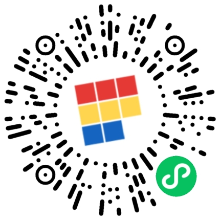
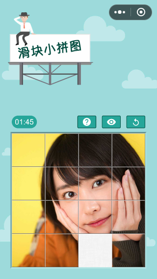

# 滑块拼图小游戏

## 示例

该游戏已经上线，请扫码进入：



## 简介

一个微信小程序游戏，基于 [pixi.js](https://github.com/pixijs/pixi.js/) 和 [JetLua/fish](https://github.com/JetLua/fish)  微信小游戏适配库实现。滑动进行方块拼接



## 如何使用

使用 `npm i` 安装依赖包

使用 `npm run build` 进行项目构建

使用 `npm run dev` 进行动态构建

打开微信开发者工具，选择 `dist` 目录导入项目文件进行开发

## 源码目录介绍

``` text
./src
├── conponents                           // 定义游戏内组件
│   ├── help.js                          // 帮助界面
│   ├── hint.js                          // 预览界面
│   ├── index.js
│   ├── info.js                          // 结束信息
│   ├── menu.js                          // 菜单界面
│   ├── piece.js                         // 拼图块组件
│   ├── puzzle.js                        // 拼图组件
│   └── timer.js                         // 计时器组件
├── core                                 // 适配器组件
│   ├── index.js                         
│   ├── layout.js                        // 适配容器
│   └── sound.js                         // 全局音效管理器
├── scenes
│   ├── game.js                          // 游戏主界面
│   ├── index.js
│   ├── preload.js                       // 载入界面
│   └── prepare.js                       // 资源加载类
├── utils
│   ├── constants.js                     // 常量
│   ├── functions.js                     // 通用方法
│   ├── gamemap.js                       // 用于提供游戏的随机地图
│   ├── index.js
│   └── swipelistener.js                 // 用于处理游戏内划动事件
├── app.js                               // 游戏入口主函数
└── config.js                            // 游戏配置

```
